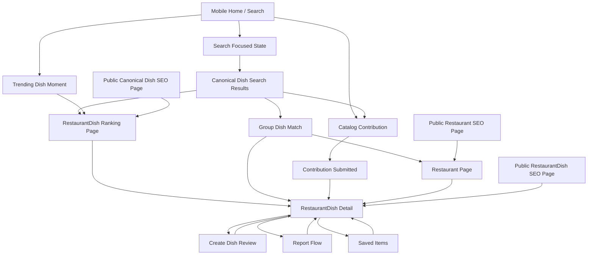

# TasteApp MVP UI Mockup Brief

Linear issue: [TST-26](https://linear.app/khoile11/issue/TST-26/define-tasteapp-mvp-information-architecture)
Related IA artifact: [TasteApp MVP Information Architecture](https://www.figma.com/board/da3SzJ39QTKTLdKYDgDlQi?utm_source=codex&utm_content=edit_in_figjam&oai_id=&request_id=7f2ff7ba-521c-4b49-b2d1-19abc84b54df)

This brief describes the visual direction and interface mockups needed before TasteApp implementation. It should guide Figma AI, UI generators, and human designers without forcing the app into a generic restaurant-review pattern.

## Creative Direction

TasteApp should feel like a playful, glossy, skeuomorphic food-ranking app where dishes are tactile hero objects, rankings are clean and trustworthy, and every major action feels light, rounded, and appetizing.

Use skeuomorphism as a direction, but not as a literal retro interface. The app should borrow real-world food texture, glossy depth, rounded physical surfaces, and collectible 3D dish objects while keeping the UI modern, readable, and fast. Think more colorful and food-forward than the skeuomorphism reference, more playful than Apple, cleaner and less busy than Samsung, with some Rivian-like restraint: calm controls, clear hierarchy, and premium physicality.

Avoid describing the style as neumorphic. The target is not pressed-in controls or low-contrast embossed surfaces. The target is glossy 3D food, soft card depth, bold dish heroes, floating bars, and warm tactile surfaces.

## Style Prompt

Create a mobile-first UI for TasteApp, a dish-first food ranking app. Use a playful glossy 3D skeuomorphic style with rounded cards, soft white surfaces, large dish hero objects, subtle food-pattern backgrounds, coral action buttons, warm highlights, and dark glossy feature panels. The product should feel fun, premium, and food-focused without becoming childish.

The interface should center `RestaurantDish` rankings, not restaurant-wide ratings. Users search for a `Canonical Dish`, compare restaurant-specific versions of that dish, match a small selected list of dishes to places where all of them are strong, open a simple RestaurantDish detail page, review the dish through food-quality signals, save items, contribute missing catalog data, and report incorrect or harmful content.

Use clear everyday labels in the mockups. Avoid overly technical product language on screen. Domain language can guide the design, but the user-facing UI should say things like "Best ramen near you", "Find a place for both", "Review this dish", "Save", "Report", and "Add a missing dish".

## Visual Ingredients

- Large glossy 3D dish illustrations, sometimes breaking out of card bounds.
- Rounded white cards with soft shadows and enough spacing to feel touchable.
- Floating bottom bars for the most important page action.
- Coral/orange circular action buttons for primary actions.
- Dark glossy hero panels for selected dish detail moments.
- Pill filters for distance, price, diet, open now, and Convenience Mode.
- Ranking badges like `#1`, `Emerging`, `Nearby`, and `Best Value`.
- Soft blush, cream, white, charcoal, tomato/coral, fresh green, and golden rating accents.
- Food-pattern backgrounds used sparingly behind hero sections.
- Clean, rounded typography with big dish names and compact supporting text.

## Software Direction For 3D Assets

The food reference image most likely combines a UI design tool with externally made 3D assets. From the screenshot alone, the exact software cannot be proven. A likely stack is Figma for UI composition plus Blender, Cinema 4D, Spline, or Adobe Dimension/Substance for the glossy 3D food models and renders. For TasteApp, use Figma for screen layouts and either Blender or Spline for custom 3D dish assets. Blender is better for high-quality food realism and reusable render pipelines; Spline is faster for web-native playful 3D exploration.

## Mockups Needed

### 1. Mobile Home / Search

Purpose: give users a dish-first entry point without pretending TasteApp is a general restaurant feed.

Needed screens:

- Default signed-in Search tab with location selector and Canonical Dish search.
- Signed-out Search tab with public discovery and sign-in prompts only when needed.
- Search focused state with suggested Canonical Dishes.
- Event-aware dish moments, only when they add dish value.

Important refinement:

Do not use a generic "review or contribute" floating prompt on the home screen unless it is tied to a clear food moment. It does not help the dish-first promise by itself. It becomes valuable when connected to a specific dish event, such as Taco Tuesday, Fryday, National Dumpling Day, a local ramen week, or a spike in discussion around a dish.

Trending should be defined by real product signals, not generic popularity:

- Spikes in recent Dish Reviews for a Canonical Dish.
- Spikes in a specific food-quality signal, such as crispiness, broth richness, value, or portion.
- Spikes in RestaurantDish saves or check-ins.
- Spikes in ordered dishes if TasteApp later receives order data.
- Personalized trend cards based on the TasteApp User's saved items, reviews, check-ins, and repeated dish interests.

MVP note:

Consider adding a lightweight dish check-in feature. A check-in is not a full Dish Review; it says "I ate this RestaurantDish" or "I tried this dish today." It can feed trending, user history, and later gamification without forcing users to write a full review every time.

### 2. Canonical Dish Search Results

Purpose: show the ranked places for one dish after the user searches for a Canonical Dish.

Needed screens:

- Search results for a query like "tonkotsu ramen".
- Empty search result with "Add missing dish" path.
- Filtered result state with distance, price, and diet pills.
- Explanation of food-quality rank versus convenience.

Clarification for "food-quality rank visible above convenience/distance":

This means distance should not silently reorder the list in MVP. If the #1 ramen is 8 miles away and the nearest ramen is ranked #7, the UI should still make that clear. Distance can filter the list, and Convenience Mode can later reorder for ease, but the original food-quality rank should remain visible so users understand the tradeoff.

### 3. RestaurantDish Ranking Page

Purpose: provide the main comparison page after selecting a Canonical Dish, before opening one specific RestaurantDish.

This is not the same as the detail page. It is the ranked list that comes after search results when the user chooses a Canonical Dish such as "tonkotsu ramen." Each ranking card can then lead into the RestaurantDish Detail screen.

Needed screens:

- Ranked list for one Canonical Dish.
- Ranking card variants for `#1`, `Emerging`, saved, nearby, and best value.
- Filter/sort tray with distance and simple preference controls.
- Ranking card selected state.
- Primary action labels such as "Review this dish" or "Save", not the internal term "CTA".

Visual guidance:

Keep this page simple and premium. Draw from the food reference image: big dish imagery, confident spacing, glossy cards, and a floating bottom action when the user has made a meaningful selection. Do not make the ranking page feel like an analytics dashboard.

### 4. RestaurantDish Detail

Purpose: show one restaurant-specific version of one dish.

This page is reached by selecting a ranking card from the RestaurantDish Ranking Page, selecting a RestaurantDish from a Restaurant page, opening a saved RestaurantDish, or landing on a public SEO RestaurantDish URL.

Needed screens:

- Hero state with large 3D dish object, dish name, Restaurant, Location, price/range if known, and rank context.
- Simple food-quality summary.
- Dish Reviews list.
- Floating bottom bar with Save, Review, and Report.
- Signed-out state where Save and Review ask for sign-in.

Clarification for "food-quality summary":

This should not feel technical. It is a simple readable summary of the required Dish Review inputs: taste, value, portion, temperature, and ingredient quality. Example: "Loved for rich broth, strong value, and generous portions." Designers can show a few friendly score chips or short phrases instead of a complicated score breakdown.

### 5. Group Dish Match

Purpose: help a small group find one Restaurant or Location where multiple selected dishes are all worth eating.

This is the pizza-plus-fried-chicken moment: users should feel like they are picking cravings, not configuring an algorithm. The screen should still make tradeoffs obvious, especially when one dish is highly ranked and another is only Emerging.

Needed screens:

- Dish picker with two selected Canonical Dishes and an affordance to add another.
- Match results for a combination such as "pizza + fried chicken".
- Result card showing the place, distance, overall match label, and per-dish evidence.
- Tradeoff state where a place is excellent for one dish but weaker or Emerging for another.
- Partial Match state where one selected dish is carrying the result and another selected dish is missing, under-reviewed, or only Emerging.
- Empty or thin-data state with a path to add a missing dish at a place.

Design guidance:

Use plain labels such as "Best for both", "Reliable for both", "Great pizza, Emerging fried chicken", and "Missing fried chicken reviews". Do not show a black-box AI score. The interface can say "match" or "fit", but it should also show why. For a search with multiple selected dishes, full matches should appear before Partial Matches; if a user opens a Partial Match, the detail view should make clear which selected dish drove the result.

### 6. Create Dish Review

Purpose: let a signed-in TasteApp User review one RestaurantDish with structured food signals.

How users reach it:

- Tap "Review this dish" from RestaurantDish Detail.
- Tap a review action from a ranking card.
- Tap from Account when continuing a draft review.
- Tap from a post-check-in prompt if the user checked in with a RestaurantDish.

Needed screens:

- Review intro confirming the RestaurantDish being reviewed.
- Required food-quality steps: taste, value, portion, temperature, ingredient quality.
- Optional written note.
- Relevant auxiliary prompt when applicable, such as crispiness for fried food or broth richness for ramen.
- Review submitted confirmation returning to RestaurantDish Detail.

### 7. Catalog Contribution

Purpose: let users add missing food data without making the product feel like admin software.

This is the flow for adding or correcting the things TasteApp needs to rank dishes: Restaurant, Location, Canonical Dish, Menu Item, and RestaurantDish. It is not a moderator workflow. User-created records start as User Submissions.

Needed screens:

- Add missing Restaurant.
- Add Location to a Restaurant.
- Add Canonical Dish.
- Add Menu Item.
- Link Menu Item to Canonical Dish to create a RestaurantDish.
- Submission Nudge state, such as "Did you mean tonkotsu ramen?"
- Contribution submitted confirmation.

Design guidance:

Make this feel like helping the app learn, not filling out a database. Use short forms, one idea per screen, friendly nudges, and food-focused language.

### 8. Saved Items

Purpose: give signed-in users a personal return path to dishes and restaurants.

Needed screens:

- Saved RestaurantDishes.
- Saved Canonical Dishes.
- Saved Restaurants.
- Empty saved state.
- Personalized prompt based on saved habits.

Open question:

Decide whether MVP Saved Items should include Canonical Dishes, or whether MVP should start with RestaurantDishes and Restaurants only.

### 9. Restaurant Page

Purpose: show what a Restaurant is known for without turning TasteApp into restaurant-wide ratings.

Needed screens:

- Restaurant profile header.
- Location list.
- Known RestaurantDishes.
- Empty state when a Restaurant has no ranked dishes yet.
- Add missing dish path.

Design guidance:

Do not emphasize a restaurant-wide score. The strongest cards on the page should be RestaurantDishes.

### 10. Report Flow

Purpose: let users report incorrect, harmful, duplicate, or low-quality content.

Needed screens:

- Report entry from RestaurantDish Detail.
- Report entry from a Dish Review.
- Reason picker.
- Short optional note.
- Confirmation state.

Design guidance:

Keep this calm, trustworthy, and brief. A Report is a moderation signal, not an automatic punishment or removal.

### 11. Web Public SEO Pages

Purpose: let TasteApp acquire users from search engines while preserving the dish-first model.

Needed screens:

- Public Canonical Dish page, such as "Best tonkotsu ramen near Austin".
- Public Restaurant page showing known RestaurantDishes.
- Public RestaurantDish page showing dish evidence and reviews.
- Signed-out prompts to save, review, or contribute.

Clarification:

These are public web pages, not a separate marketing site. They should help people arrive from Google, understand the dish ranking, and continue into the app.

## Figma Page Flow

## Project Structure Recommendation

Frontend UI page design and backend ingestion are important enough to split into distinct workstreams, but they should not be bundled into one vague "frontend plus backend ingestion" project.

Critical take:

- UI mockups are a product/design workstream. Their risk is clarity: can users understand dish-first search, rankings, review creation, contribution, and reporting?
- Backend ingestion is a catalog/data engineering workstream. Its risk is correctness: can TasteApp accept messy user-created Restaurants, Locations, Canonical Dishes, Menu Items, RestaurantDishes, check-ins, reports, and reviews without corrupting ranking truth?
- The two workstreams must share contracts, but they move at different speeds and have different acceptance criteria.

Recommended Linear shape:

- Keep TST-26 inside the current MVP project as the IA/design foundation ticket.
- Create a separate project or project workstream for **MVP Product Experience** if the team wants multiple UI mockup, design-system, and prototype tickets.
- Create a separate project or project workstream for **Catalog Ingestion & Review Integrity** if ingestion, verification state, check-ins, reports, and moderation queues become more than a few issues.
- Do not create one combined project called "Frontend UI and Backend Ingestion." That couples visual design to data integrity in a way that will hide blockers.

The clean split is:

- **MVP Product Experience**: Figma screens, navigation, design system starter, mobile/web UI, user flows.
- **Catalog Ingestion & Review Integrity**: contribution flows, verification states, check-ins, reports, moderation queues, ranking-safe data rules.

## Terms To Avoid In UI Copy

- Avoid `CTA`; say primary action, button, or action.
- Avoid `RestaurantDish` in user-facing copy unless the screen is internal. Say "dish at this restaurant" or use the dish and restaurant names.
- Avoid "score breakdown" if it feels technical. Say "why people like it", "food highlights", or "review summary".
- Avoid generic "trending" unless it is backed by review, save, check-in, or order signals.
